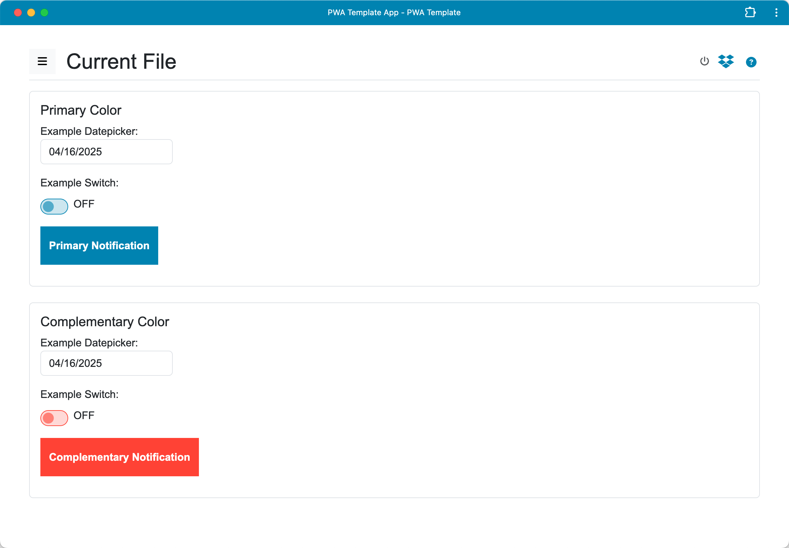

# Generic PWA Template

A Progressive Web Application (PWA) template featuring local file management and optional Dropbox integration.

This template provides a starting point for building PWAs that need to:
*   Work offline using a Service Worker.
*   Manage multiple local text-based files (e.g., `.txt`, `.md`).
*   Optionally sync files with a user's Dropbox account.
*   Utilize a Bootstrap 5 based UI.

It includes features like adding, renaming, deleting, and switching between local files, along with a robust Dropbox sync mechanism handling online/offline status and potential conflicts.

## Help

For detailed instructions on how to use the application's features, please see the [Help](help.md).



## Usage for Development

To use this template for development:

1.  **Install Node.js dependencies:**
    ```bash
    npm install
    ```
    This command installs the necessary packages for the development server (currently just used for serving files).

2.  **Start the development server:**
    ```bash
    node node-server.js [--verbose]
    ```
    This command launches the Node.js server, which will serve the PWA locally.

3.  **Optional: Generate local HTTPS certificates:**
    To run the server with HTTPS (required for testing certain PWA features like installability more robustly or features requiring a secure context beyond `localhost`), and assuming `mkcert` is installed, generate the certificate files:
    ```bash
    # Run this in the project's root directory
    mkcert localhost 127.0.0.1 ::1
    ```
    This generates `localhost+N.pem` and `localhost+N-key.pem` files in the current directory, which the secure server command will automatically use. Only needed to do this once unless the certificates expire or the directory is cleared. It is necessary to run `mkcert -install` once beforehand if you haven't already configured the local CA.

4.  **Start secure server:**
    ```bash
    node node-server.js --secure [--verbose]
    ```

5.  **Open the PWA in your web browser:**
    Once the server is running, you can access the webapp by navigating to the server address in your browser. Typically, this will be `http://localhost:8000` or `https://localhost:8000` if using secure mode.

## Optional: Dropbox Integration Setup

To enable Dropbox integration for your application based on this template:

1.  **Create a Dropbox App:**
    *   Go to the [Dropbox App Console](https://www.dropbox.com/developers/apps).
    *   Create a new app. Choose "Scoped access" and select the necessary permissions (e.g., `files.content.write`, `files.content.read`). For "Access type", choose "App folder".
    *   Note your App key (Client ID).

2.  **Configure Redirect URI:**
    *   In your Dropbox App settings, under "OAuth 2", add the Redirect URI(s) where your app will be hosted during development and in production. The template currently calculates the development URI dynamically based on `window.location`. For local development using the provided server, this will likely be `http://localhost:8000/` or `https://localhost:8000/`. Add any production URIs as well.

3.  **Update Template Configuration:**
    *   Open `assets/js/dropbox/config.js`.
    *   Update the `CLIENT_ID` variable with your actual Dropbox App Key.
    ```javascript
    export const CLIENT_ID = 'YOUR_DROPBOX_APP_KEY'; // Replace with your actual Dropbox App Key
    ```

## Contributing

Contributions to improve this PWA template are welcome. For major changes, please open an issue first to discuss what you would like to change.

## License

This project is licensed under the MIT License - see the [LICENSE](LICENSE) file for details.
